# Cryptocurrency - A Small View Into the World of Ethereum ("ETH")

By: Camillo D'Orazio, Collin Holben, Justin John, Todd Shevlin - November 2020

15

## Overview and Origin of ETH

A 19-year-old Russian programmer from Toronto, Vitalik Buterin, conceived the idea for *Ethereum*. The Ethereum white paper was released in 2013, the coin was launched in 2015 and went mainstrain in 2017 when the price jumped by more than 1000% over the course of a few months.2 **ETH** is the second most popular cryptocurrency by market capitalization and, arguably, the most popular blockchain platform in existence today. **ETH** provides a framework for a decentralized application on the blockchain, has a large network of ERC-20 tokens and coined the term *"smart contracts"* 3 

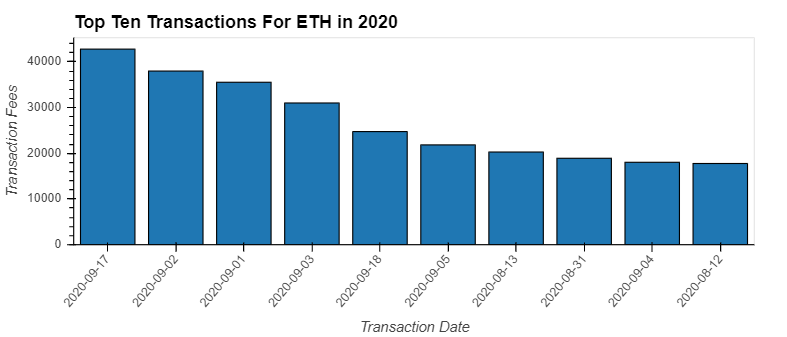8
    
____________________________________________________________________________________________________________________

## What is Blockchain technology and how does it work?
*Blockchain* technology is highly sophisticated and a complex structure with many substructures. Blockchain allows for decentralization, i.e. no central regulatory body who oversees the transactions on the platform. Instead, it uses what is referred to as a *distributed or digital ledger* (NOTE: these terms are used interchangeably). The simplest way to describe what *Blockchain* is, or how it works is: “Picture a spreadsheet that is duplicated thousands of times across a network of computers. Then imagine that this network is designed to regularly update this spreadsheet and you have a basic understanding of the blockchain.” 4

### There are 3 pillars of *Blockchain*:
    
1. Decentralization
    - Defined as data that is recorded and stored on multiple devices in multiple locations all around the world as opposed to one central place. It also means that no one person, company, Goverment, authority or entity controls the data recording and storage process. Unlike centralized entities like the IRS in the U.S., Banks, or Colleges/Universities, as examples.
    
2. Transparency
    - Relates to the way transactions are recorded on a ledger that is available for everyone to see. The data is saved on a network of computers around the world making the data impossible to be altered or affected. One example to compare this scenario to is how every tax dollar is spent by the United States Government. If the information is publicly available, it is easy to manipulate or forge since the U.S. Goverment controls that data unlike blockchain technology, where not one person or entity controls the data.
    
3. Immutability
    - Simply means that the data recorded and stored on the blockchain cannot be forged or manipulated and that is through a process called cryptography and blockchain hashing.

____________________________________________________________________________________________________________________

## Bitcoin versus Ethereum - What's the difference? They are both crypto, right?

*Bitcoin* and *Ethereum* are both use cases of Blockchain Technology but with different purposes. 5

- *Bitcoin* is a digital currency that people use as a form of payment. People transfer *Bitcoin* to and from each other or hold the currency long-term as an asset of value.

- *Ethereum* is a programmable blockchain that people can build software on top of to create products and services. Due to the decentralized property of the blockchain, software developers and programmers can build onto *Ethereum* with the ultimate goal of decentralized finance (DeFi). The aim is for a movement to transform the current financial system into a more transparent and trustworthy system.

- A good analogy would be that bitcoin is like iOS, and Ethereum is like Android (controlled vs open source).

### Price Comparison between Bitcoin and Ethereum - (Past 5 years)

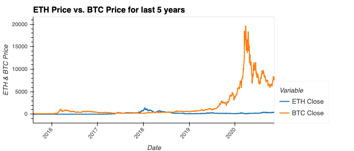8

### ETH Price Compared to Different Asset Classes - (Past 5 years)

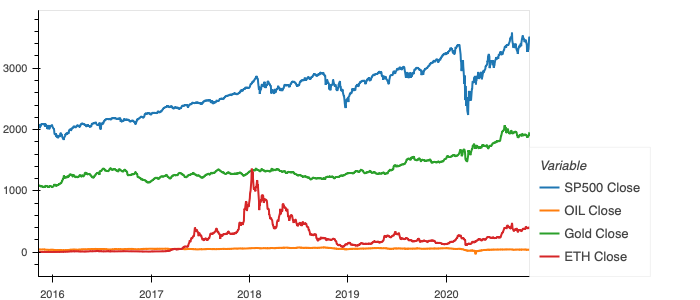8

____________________________________________________________________________________________________________________

## *Ethereum* speak - The basics 6 

## What is Ether

- Ether is the *Ethereum* Blockchain native cryptocurrency that operates similarly to *Bitcoin* that its a digital currency that can be transferred to people around the world, used as a form of payment or act as an asset of value.
- *Bitcoin* is described as digital gold, while *Ether* is described as digital oil.
- Ether was designed with the intention of fueling the *Ethereum* Network.
- To fuel the *Ethereum* network you have to pay for computing power and space required using Ether. The network charges transaction fees that is determined by a built-in pricing system known as *GAS*.
- Another noteworthy difference between *Ether* and *Bitcoin ("BTC")* is that *BTC* has a fixed supply while *ETH* does not has a fixed supply.

## What is *GAS*?

- *GAS* is how transaction costs are computed for *ETH* transactions and considers bandwidth, space requirements, as well as, the computational difficulty of each transaction to calculate the appropriate amount of fees needed to complete each transaction.
- When executing transactions on *Ethereum* you will see *GAS* prices denoted as *GWEI (a.k.a. Giga Wei)* units.
    - *GWEI* to *Ether* can be compared like 1 penny to 1 US Dollar.

7

- Denominations of power are represented as a Wei value is used to calculate *GAS* transaction costs.

- The higher the amount of *GAS*, the faster the transaction will be processed.

### Comparison between Sum of Daily Transactions & Daily Sum of ETH

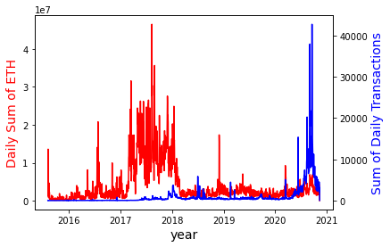8
    
### Comparison between Sum of Daily Transactions & ETH Price

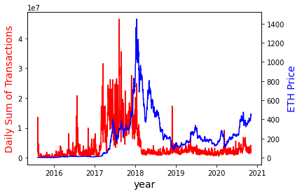8

## Basics of an *Ethereum* Network

- The base layer of *Ethereum* consists of a vast network of computers called *nodes*.
    - These *nodes* are connected to the internet with software installed on local computers that run on the *Ethereum* Blockchain. 
    - This base layer of *nodes* is where the transaction data is processed, validated and stored.
    - While the *nodes* perform the computational work required to process transaction data, they are rewarded with Ether, dictated by the *GAS* calculated for each transaction,
- The second layer on top of the base hardware layer acts as a software layer.
    - This software layer supports a programming language library which consists of solidity, viper, bamboo, etc. 
    - Using these programming languages developers can write *smart contracts*.
    - *Smart contracts* make transactions trackable, transparent and permanent.
- The combination of both the base layer and second layer creates a global decentralized super computer known as the *"Ethereum Virtual Machine"*. 
    - The combination of both layers eliminates the need for a central authority to govern your data or your finances like a governmentt, bank or legal system. 

____________________________________________________________________________________________________________________

## ETH Price Analysis 

### A Closer look at ETH Price

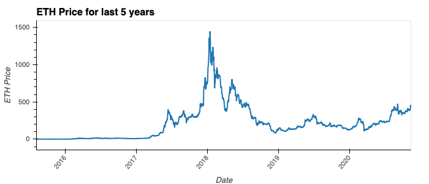8

## Investment Analysis (Risks and Opportunities)

### Rolling Standard Deviation of ETH vs. Currencies & Asset Classes

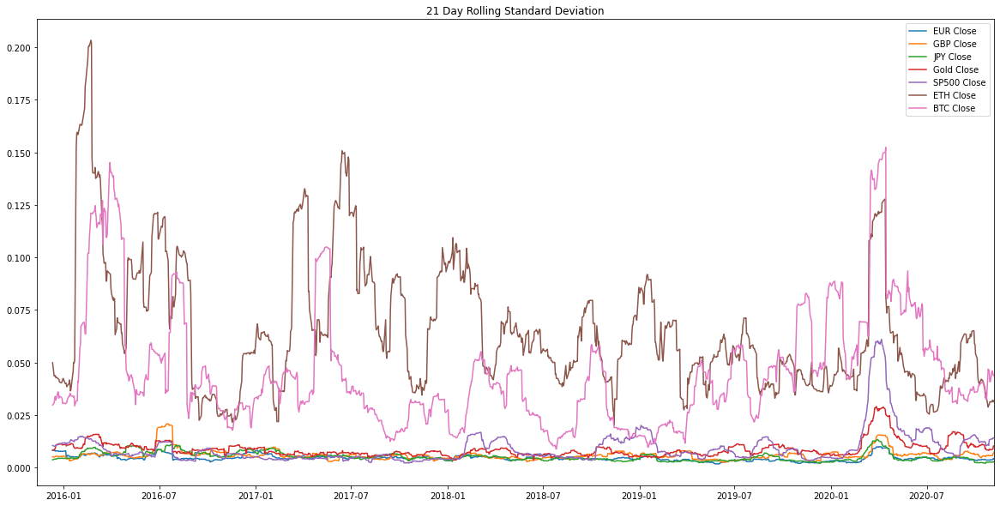8

### Percentage Change of ETH vs. Currencies & Asset Classes

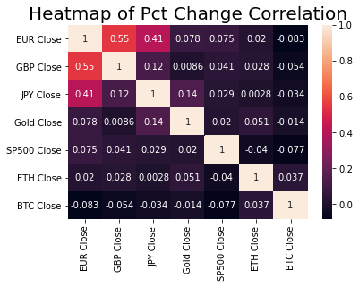8

### Risk of ETH vs. Currencies & Asset Classes

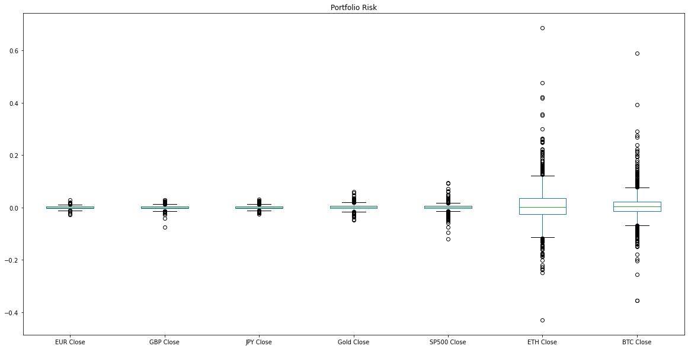8

### Sharpe Ratio of ETH vs. Currencies & Asset Classes

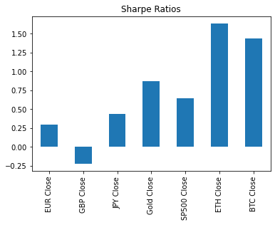8
 
### Drawdown of ETH vs. Currencies & Asset Classes
 
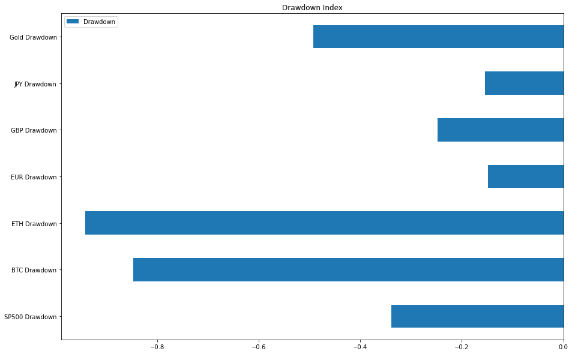8

### Mining Difficulty vs. ETH Price

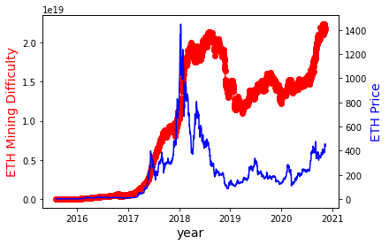8

## Observations and Recommendations
In looking at these charts closely, you will notice that Ethereum is extremely volatile, though is also a good hedge against other asset classes.  Also, despite the high volatility, it has a very high "alpha" (excess return), indicating that it can be highly profitable as long as you invest responsibly.  Compared with currencies, it does not correlate especially well.  This is to be expected as most of the comparison currencies are mature and heavily traded. 

## Post Mortem/Lessons Learned
- We definitely learned a lot about collaboration during this project.  Early on we split tasks between data attainment and vizualization preparation.  An early issue we ran into that persisted throughout the project was challenges related to the repository.  After cloning, there were problems pushing up documents, switching branches, having to rebase, re-clone, getting overwrite warnings, etc.  A much different experience than working on a solo project. 
- We also ran into challenges identifying good API's to use, and running out of available data to pull (unless we paid to upgrade).  Some of the data received was also in a format that was difficult to convert to a dataframe.  Converting dates was also required on most of the imports. We used a variety of data sources - Google BigQuery, CoinGecko, GoogleFinance, Yahoo Finance, and some direct downloads.  Each comes with its own setup, documentation, and methodology.  Our repository also reached its monthly limit, which created challenges pushing additional documents due to the size of some of the .CSVs.  In the future we will just utilize API's to do live calls for the data.
- Preparing the data for the final presentation was also a challenge, as PyViz has some anomalies that we had to work through.  We originally coded this in a procedural manner, and had to convert to a functional process.  Having to modify the code and associated source dataframes took a lot of time.  It would have been much easier to begin coding in this manner.
- We intended to use the Dash package for some visuals, though having to learn the nuances of this package in a limited time frame made it difficult for us to get a working visual for the final presentation.

____________________________________________________________________________________________________________________
## Works Cited

1 ETH coin image - https://www.howtogeek.com/thumbcache/2/200/832a97c90178c6a52354c0b42cea6954/wp-content/uploads/2018/04/img_5ae3b681c9ae2.jpg

2 Bitcoin Magazine https://bitcoinmagazine.com/guides/who-created-ethereum

3 Moeller, M. (2018, February 26) *Ethereum Competitors: Guide to the Alternative Smart Contract Platforms* Blockonomi.com https://blockonomi.com/ethereum-competitors/

4 Dughi, P. (2018, February 3) *A simple explanation of how blockchain works* Mission.org https://medium.com/the-mission/a-simple-explanation-on-how-blockchain-works-e52f75da6e9a#:~:text=Blockchain%20is%20the%20technology%20the%20underpins%20digital%20currency,a%20%E2%80%9Cdigital%20ledger%E2%80%9D%20stored%20in%20a%20distributed%20network.

5 Reiff, N. (2020, June 16) *Bitcoin vs. Ethereum: What's the Difference?* Investopedia https://www.investopedia.com/articles/investing/031416/bitcoin-vs-ethereum-driven-different-purposes.asp.

6 YouTube video: https://www.youtube.com/watch?v=DhoRtGCp4JI

7 Denominations of Ether source: https://nagritech.com/wp-content/uploads/2020/04/Screenshot-22.png

